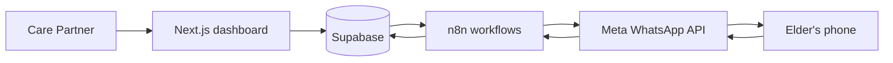

# ElderWise

**Staying close, from a distance.**

Families separated by distance still need to know that an ageing parent took their tablets, ate, and is well today. Most of those parents will not — or cannot — install another app. ElderWise keeps the family informed through a Care Partner dashboard, and reaches the Loved One only on WhatsApp, which they already use.

---

> **Proprietary software. All rights reserved.**
>
> No permission is granted to copy, reproduce, modify, merge, publish, distribute, sublicense, sell, **deploy, or run** this software or any part of it, for any purpose, without prior written authorisation.
>
> This repository is public **for review only**. Viewing it does not grant a licence. See [LICENSE](LICENSE).
>
> Authorisation requests: [elderwise0@gmail.com](mailto:elderwise0@gmail.com)

---


## What it does

The Loved One never logs in and never installs ElderWise. Check-ins, reminders, SOS, and voice notes arrive as WhatsApp messages. The Care Partner configures routines, watches adherence, and manages the care circle from the web dashboard.


**Daily check-ins.** Medication, meals, and wellbeing prompts go out on the schedule the family sets. The Loved One answers with a tap on WhatsApp buttons, or by sending a voice note that is transcribed.


**Reminders and escalation.** If a check-in goes unanswered, ElderWise sends a reminder, then records a miss. The Care Partner can be notified when a check-in is missed.


**SOS.** The Loved One can raise an emergency from WhatsApp. The care circle is alerted in parallel — Care Partner, optional Local Buddy, optional Family Doctor — with resolution tracking. The Loved One can also cancel an open alert in-channel.


**Voice Journal.** Unprompted voice notes from the Loved One are stored so the family can listen on the dashboard.


**Doctor share links.** The Care Partner can issue a scoped, revocable, time-limited read-only page for a Family Doctor — no doctor account required.

**Wellbeing reports.** PDF and CSV reports are generated on demand from check-in history. Nothing is stored as a separate reports archive.

**Two-layer consent.** The Care Partner attests at onboarding; the Loved One must confirm in WhatsApp before anything is scheduled. Silence is not consent. A decline is terminal — they are not messaged again.


## Architecture

Two tracks meet **only at the database**. Next.js never sends WhatsApp. n8n never renders UI.

- **Track A** — Next.js (App Router) dashboard on Vercel. Supabase Postgres with row-level security. Supabase Storage for voice audio.
- **Track B** — n8n workflows on a self-hosted VPS. The entire WhatsApp message path runs through the Meta WhatsApp Business API.



The workflow layer, conceptually:

- **Scheduling** — materialise and send medication, meal, and wellbeing check-ins
- **Inbound routing** — receive WhatsApp replies and hand them to the right handler
- **Response handling** — record button and list answers
- **Reminder and missed sweeps** — one reminder, then mark unanswered check-ins missed
- **Notification dispatch** — Care Partner messages for interactions and misses
- **Voice transcription** — download voice replies, transcribe, store the audio
- **SOS orchestration** — alert the care circle, nudge, resolve, elder-initiated cancel
- **Orphan storage cleanup** — sweep leftover voice objects after a delete

## Tech stack

| Layer | Choice |
|---|---|
| Dashboard | Next.js App Router, React, TypeScript |
| UI | Tailwind CSS, shadcn/ui |
| Data & auth | Supabase (Postgres, Auth, Storage, RLS) |
| Message path | n8n, Meta WhatsApp Business API |
| Voice | OpenAI transcription (via n8n) |
| Rate limiting | Upstash Redis |
| Errors | Sentry |
| Hosting | Vercel (dashboard), self-hosted VPS (n8n) |

## Security and privacy

- **Row-level security on every table.** A Care Partner reaches only their own Loved Ones.
- **Service-role access is server-side only.** It never ships to the browser.
- **Voice recordings** live in a private bucket. Playback uses a short-lived signed URL after session ownership is proven.
- **Doctor share links** are token-scoped, revocable, and rate-limited.
- **Deletion is genuine.** Removing a Loved One or an account deletes the rows and the stored recordings. An audit record of the deletion is retained.

ElderWise supports family communication and routine monitoring. It is **not** a substitute for professional medical advice or emergency services.

## Project documentation

`main` on this repository is the single source of truth.

| Doc | What it is |
|---|---|
| [PRD.md](PRD.md) | What ElderWise does |
| [Architecture.md](Architecture.md) | How it is built |
| [Rules.md](Rules.md) | Non-negotiables for humans and agents |
| [Phases.md](Phases.md) | Build plan and what has shipped |
| [Templates.md](Templates.md) | WhatsApp template catalogue |
| [PostDemoEnhancements.md](PostDemoEnhancements.md) | Deferred work after Demo Day |

## Local development

Running this project requires **prior written authorisation**. See [LICENSE](LICENSE). The public repository is for review, not for deployment.

If you have authorisation, copy `.env.example` to `.env.local` and fill the variables listed there. Then:

```bash
npm install
npm run dev
```

## Status and credits

ElderWise is a capstone project for the **AI Generalist Fellowship (AIGF), Cohort 7**.

Built by **AIGF-Group7**.

## Licence

Copyright (c) 2026 AIGF-Group7. All rights reserved. See [LICENSE](LICENSE).

Authorisation: [elderwise0@gmail.com](mailto:elderwise0@gmail.com)
